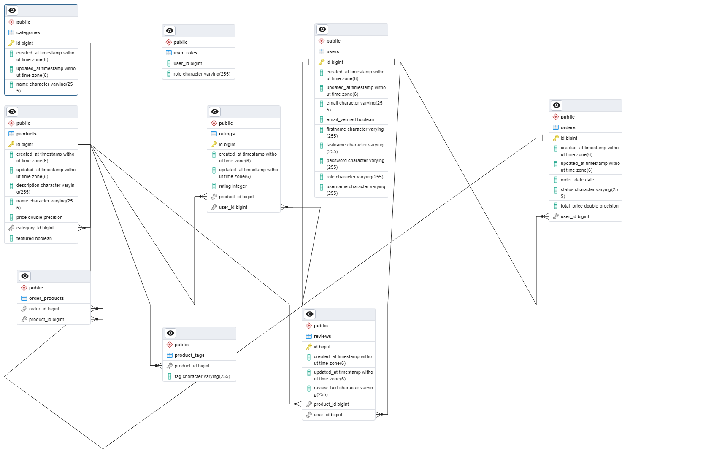
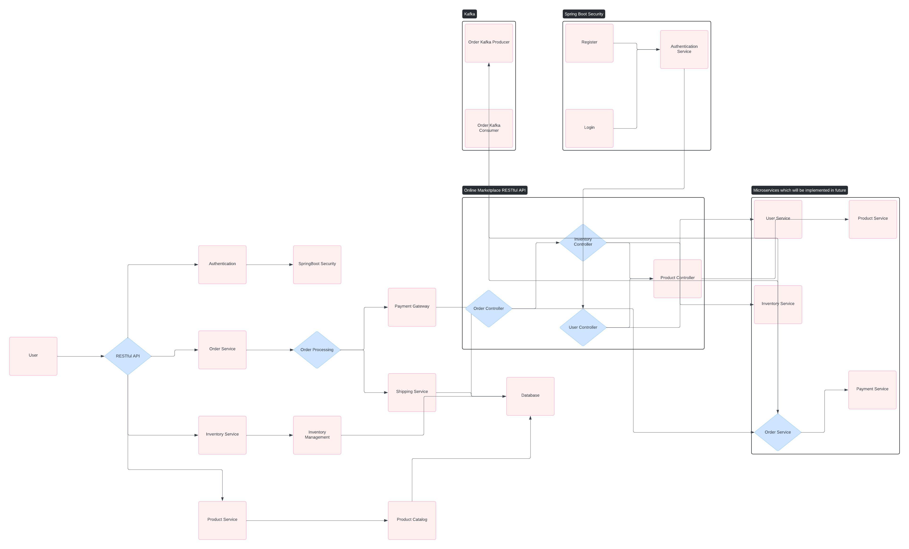

# Marketplace

This is a comprehensive RESTful API for an online marketplace that allows users to buy and sell products, manage their inventory, and process orders.

## Development

- Create `.env` file and copy in `.env.example` values
- Update your local database connection in `application.yml` or create your own `application-local.yml` file to override
settings for development.

## Features
- `User Authentication and Authorization`: Users can register, log in, and manage their profiles. Shoppers receive an email verification upon registration.
- `Product Management`: Admin users can create, update, and delete products for sale. They can also mark products as featured.
- `Order Management`: Shoppers can place orders, view order history, and track order status. Orders are processed asynchronously using a queue system (e.g., RabbitMQ, Kafka) for scalability.
- `Category Management`: Products can be categorized for easy browsing.
- `Review and Rating System`: Shoppers can review and rate products for which they have placed orders.
- `Email Notifications`: Shoppers receive email notifications for order status updates.
- `Search and Filtering`: Shoppers can browse products by category, tags, and search.
- `Role-Based Access Control (RBAC)`: Different user roles (such as: admin, buyer, seller) have varying access permissions.

## Requirements

Install the following dependencies globally on your system:

- Install [Docker](https://www.docker.com/)
- Install `Make` depending on your OS. [Windows Installation](https://linuxhint.com/install-use-make-windows/), [Ubuntu Installation](https://linuxhint.com/install-make-ubuntu/)

### Technologies Used

- **Backend Framework**: [Spring Boot]
- **Database**: PostgreSQL
- **Authentication**: JWT
- **Containerization**: Docker and Docker Compose

## Getting Started

### Prerequisites

- [Docker](https://www.docker.com/) and [Docker Compose](https://docs.docker.com/compose/) are installed on your machine.

### Installation

1. Clone the repository: `git clone https://github.com/Nkbtemmy/online-marketplace-be.git`
2. Navigate to the project directory: `cd online-marketplace-be`
3. Build the Docker images: `docker-compose build`
4. Start the application: `docker-compose up` or
5. Run ``make start`` or ``make dev`` if you have makefile installed
6. For testing, you can run ``make testing``

The API will be available at `http://localhost:8080`.
### Docker Images Used
- **marketplace-be**: The application image
- **postgres-db**: PostgresSQL Database
- **zookeeper-server**: Message Queue for kafka
- **kafka-broker**: Kafka broker itself
- **kafdrop-web**: Kafka UI help to visualizing kafka Topics and its contents

### API Documentation

The API is documented using Swagger OpenAPI 3.0. You can access the documentation at `http://localhost:8080/api/v1/marketplace/docs` once the application is running.

## Database Schema

## System Design

## Testing

This project includes unit and integration tests with required coverage.

## Further readings

* [Maven docs](https://maven.apache.org/guides/index.html)  
* [Spring Boot reference](https://docs.spring.io/spring-boot/docs/current/reference/htmlsingle/)  
* [Spring Data JPA reference](https://docs.spring.io/spring-data/jpa/reference/jpa.html)